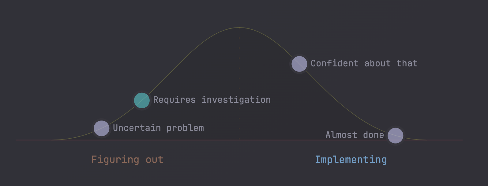

# Interactive Hill Chart

An [Obsidian](https://obsidian.md) plugin for tracking work progress on a hill chart. Dots are draggable, linked to notes, and live entirely inside your vault — no external services, no hidden state.



---

## What is a Hill Chart?

A hill chart visualizes progress as a hill: the **left (uphill) side** represents work that is still being figured out, and the **right (downhill) side** represents work that is being executed. Moving a dot over the peak signals a shift from uncertainty to confidence.

---

## Quick Start

Create a fenced code block with the `hill-chart` language tag:

````md
```hill-chart
dots:
  - 10: Research
  - 40: Design
  - 70: Build
  - 90: Ship
```
````

Each entry is `- <position>: <label>`, where position is `0`–`100`. Drag a dot to update its position — changes are written back to the code block automatically. Use Obsidian wiki-link syntax as a label (`"[[Note Name]]"`) to make it clickable.

---

## CSS Variables and Theming

All colors default to `currentColor` (Obsidian's text color), so charts work in light and dark themes out of the box. Every color field accepts any of these formats:

```yaml
color: currentColor          # inherits Obsidian text color (default)
color: var(--text-muted)     # any Obsidian CSS token
color: var(--color-accent)
color: "#23ad32"             # hex — 3, 4, 6, or 8 digits
color: "#fff"
color: "#ffffff80"           # hex with alpha
color: rgb(35, 173, 50)
color: rgba(35, 173, 50, 0.5)
color: hsl(130, 66%, 41%)
color: hsla(130, 66%, 41%, 0.8)
color: red                   # any CSS named color
color: transparent
```

---

## Full Example

````md
```hill-chart
chart:
  curve:
    stroke: "#23ad32"
    strokeWidth: 2
    fill: none
  baseline:
    visible: true
    stroke: "#23ad32"
    opacity: 0.2
    strokeWidth: 1
  uphill:
    label: "Figuring it out"
    fontSize: 11
    color: var(--text-muted)
  downhill:
    label: "Making it happen"
    fontSize: 11
    color: var(--text-muted)
  divider:
    visible: true
    stroke: var(--text-muted)
    strokeWidth: 1
    style: dashed
  dot:
    color: "#23ad32"
    opacity: 0.85
    radius: 7
    fontSize: 11
    fontColor: var(--text-muted)
dots:
  - 5: "[[Idea]]"
  - position: 30
    label: "[[Research]]"
  - position: 55
    label: "[[Design]]"
    style:
      color: "#f5a623"
      opacity: 0.9
      radius: 9
      fontSize: 13
      fontColor: var(--text-muted)
  - position: 80
    label: "[[Build]]"
  - 95: "[[Ship]]"
```
````

---

## Acknowledgements

Inspired by [obsidian-hill-charts](https://github.com/stufro/obsidian-hill-charts) by stufro.

---

**Releasing:** see [RELEASING.md](RELEASING.md)